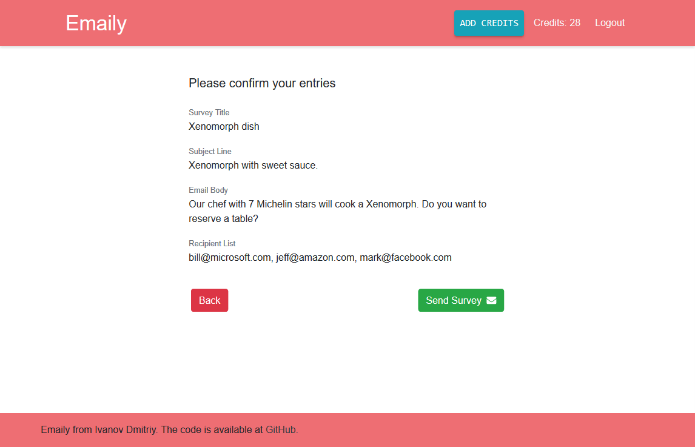

# Emaily

Emaily is a mini email surveys service. Created as a fullstack JavaScript application on React and Node. With technologies like Redux, Redux Thunk, React Router, Express, MongoDB and Bootstrap for styling. 

This application implements the ability to log in using Google oauth. It uses plugin passport for the Node and connected strategy passport-google-oauth20. To send Emails used SendGrid API. And to simulate charging, the Stripe API is connected in test mode. All received data is stored on mongodb.com and managed using the mongoose plugin.

   > You can view [live demo](https://emaily-id.herokuapp.com/)   
   > Because it's free heroku account, it goes to the "App is asleep" mode and may load for some time.

Once you are logged in, you can view a list of previously created surveys, initially sorted by creation date, but with the ability to sort by other fields. You can see this list in the screenshot above. If you have not yet created a single survey, you can do this by clicking on the big red round button with a plus sign (In the screenshot, this button is in the middle right, but this is how screenshots are taken through the add-on in the browser. The application is always in the bottom right corner. It is `position: fixed`). After that, a window will open where you can create a survey of four fields: the name for our list, the email header, the text displayed in the body of the email, a comma-separated list of email addresses. After clicking Next, you are prompted to check the entered data with the ability to return and correct or send to the specified addresses if everything is correct. This is shown in the screenshot below.

After the letters are delivered, you can click on the links placed inside and using SendGrid Webhooks the selected option is transferred to our server. Each vote adds 1 to the selected option. 

### Running locally

if you want to run this project on your machine, then after downloading you need to run `npm install` in the root of the repository and once more in the `client` folder. Next, in the _config_ folder, create the _dev.js_ file and add all the necessary data to connect to the database and third-party services. You can see the structure in the _template.dev.js_ file. Then you need to run the `npm run dev` command - this will start both the backend server and the frontend server.

   > this project was made during the Node with React: Fullstack Web Development course at udemy.com and then improved.